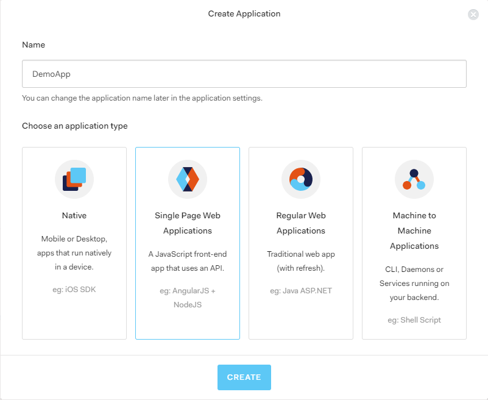
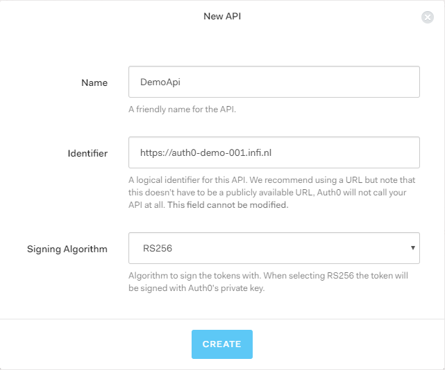
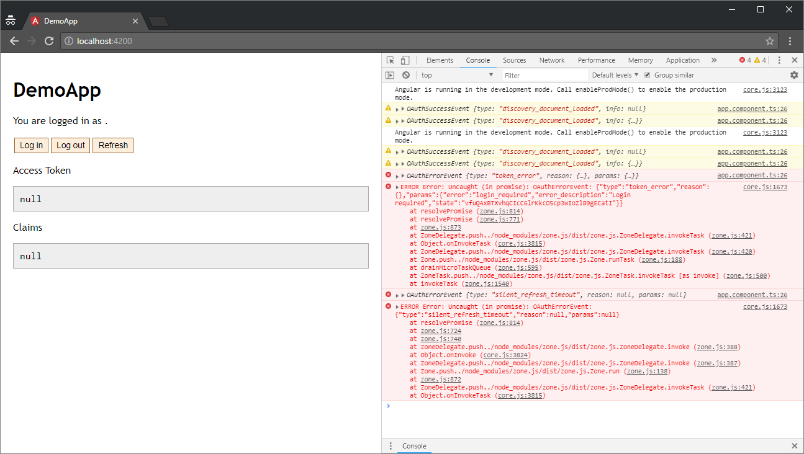
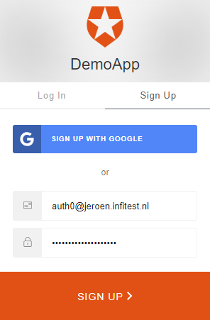
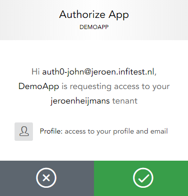
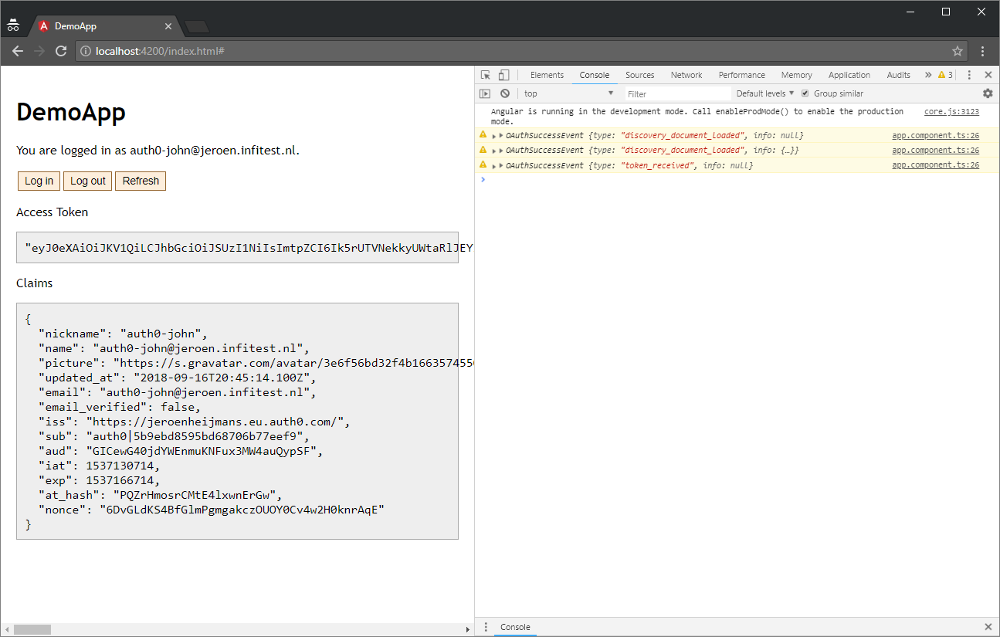

# Sample Auth0 and Angular-OAuth2-OIDC Application

This repository demonstrates how to connect your Angular 6 application to Auth0 using the implicit flow.
It is the companion to a blog post written for [Infi](https://infi.nl).

## Disclaimers

Let's get some disclaimers out of the way.
This repository is **frozen in time**: it was created in **September 2018** and probably never updated.
So you might have to adjust the advice here for your own timeline.

Second, this repository demonstrates **how to connect the dots** but it also **glosses over details**.
It should help you get started, or grasp the idea.
But please adjust accordingly for production applications.

## Let's get started

This is a very specific, technical, pragmatic post.
It's just what we enjoy at Infi: getting those important details just right.
If you came here for fluffy content about agile, or projects, or fun stuff: better skip this post.
You've been warned!

Actually, this is one post in a series:

1. The "About" part, describing all moving parts and processes.
1. The "Gimme-teh-codez" part, that walks you through the code.

If you already know how the Implicit Flow works, you can safely skip parts of the post.
If code says more than words to you, or if you know how Auth0 works, you can safely skip the entire post, and go straight to part 2.
For the rest of us, we'll start at the beginning.

Let's get cracking!

## About the things involved

Let's first get our terminology straight.
What's what!?

### About the Implicit Flow

OAuth2 and OpenID Connect are standards for how to authenticate and (to some degree) authorize users in your systems.
It assumes this type of setup with three items:

1. An **Identity Server** application handles user accounts, passwords, 2FA, and all that good jazz.
1. **Clients** (like an Angular application) that send their users to the Id Server to log in, (after which they're redirected back to the Client).
1. Your **API**, which needs the access token on each call to verify access.

This differs from the slightly simpler (but less secure) **Resource Owner Password** flow.
With the Implicit Flow the Client never sees credentials: users trust only the Id Server with those.
On the downside, you do have some redirection going on for the user.
The user sees login screens from the Id Server, but this should not be a big problem because:

- Either it's a well-known provider, and users are right to trust it.
- Or it's your own identity server, and you can style things to make it "part of the client experience".

Oh, and this flow also quite naturally supports external Identity Providers (the "log in with Google/GitHub/etc" stuff).
Which is very nice for users.

This series focuses mainly on interaction between the **Identity Server** (Auth0) and an (Angular 6+) **Client**.
Let's dive into the details about the moving parts.

Footnote: read more about [the Implicit Flow in RFC 6749](https://tools.ietf.org/html/rfc6749#section-1.3.2).

### About the Identity Server

You can of course create your own Identity Server.
Security is hard though, so don't completely roll your own.
Instead, use an existing solution to build from.

There's good ones available for nearly every tech stack.
For .NET there's [IdentityServer](https://identityserver.io/), Java e.g. has [spring-oauth-server](https://github.com/authlete/spring-oauth-server), and so forth.

However, there are also SAAS solutions (sometimes called IDaaS) available.
For example [Okta](https://www.okta.com/), [Keycloak](https://www.keycloak.org/), and [Auth0](https://auth0.com/).
In this tutorial we use **Auth0** (a comparison is left for another time).

### About the API

In this post we won't touch on the API side of things.
The beauty of OAuth2 is that the API side of things is largely *decoupled* from the rest.
We will get to the point where access tokens are sent to a dummy API, and assume everything would work from there.

There is one important note about the flow relevant though.
Tokens are passed plainly to the API by the client application.
The format for such tokens is "JWT" (pronounced like "jot"), typically at least *signed* (JWS), or alternatively *encrypted* (JWE).
Your API can verify (or decrypt) the tokens.

To do this the API will need to get the public key (or decryption key) from the ID Server.
It typically does so "live", by calling the ID Server (cached and refreshed every so often).
But you can also provide these keys out of band.

Footnote: read more about [JSON Web Tokens (JWT) in RFC 7519](https://tools.ietf.org/html/rfc7519).

### About the Client

For OAuth2, a "Client" is an abstract concept.
It can be a Single Page Web App, a mobile application, a traditional MVC Web App, or even another API.
When talking about "the Client" in this post, we're talking about our Angular 6+ CLI application.
The Implicit Flow is well-suited for Single Page (JavaScript) Applications.

When a Client determines that a user should log in, it redirects the user to the Identity Server.
The user logs in at the Identity Server, and gets redirected back to the Client.
The Client at this point expects that the user "brings back" the access token (and possibly id token).
This is typically done by the Identity Server redirecting back to the URL of the client with tokens in the hash fragment of the URL.

We will build an Angular CLI application from scratch in part 2 of this series.
In it we will use one of the available libraries for handling the OAuth2 and OpenID Connect parts: [`angular-oauth2-oidc`](https://github.com/manfredsteyer/angular-oauth2-oidc).
The Angular application will require users to log in with Auth0, and send the retrieved tokens along to the dummy API.

Footnote: read more about [Clients in RFC 6749](https://tools.ietf.org/html/rfc6749#section-2).

## Putting things together

Let's put what we learned above in a picture:


The two lines between Client and ID Server in this (simplified!) visualization *are* "the Flow".
They determine how a Client can retrieve a token from the ID Server.

Some specific things missing in the picture:

- All log in screens happening when the user is at the ID Server. We use Auth0 in this series, so it's all taken care of for us.
- Third party logins, e.g. "Log in with Google". This would include a fourth box all the way to the left, but with Auth0 that only requires configuration, no coding on our part.
- Silent refreshes: access tokens are short lived, so you need to get a fresh one every hour or so. Turns out that's just the normal flow in a hidden iframe, how it works is shown when we work on the code.

And that's all there is to it!
In the next part we will start working on the actual code.

## Let's Code

In the previous part we discussed the OAuth2 Implicit Flow.
But code is a more efficient way of communicating, don't you think?
So let's get to it!

If you're here just for the code: no problem!
To get a full example of how the client side library is supposed to work, you should check out [the `sample-angular-oauth2-oidc-with-auth-guards` repository](https://github.com/jeroenheijmans/sample-angular-oauth2-oidc-with-auth-guards), which has a *production-worthy* example of how to use the library.
It would need to be reconfigured to use Auth0 however.
So if you want to see a *minimal* example of how to use it with Auth0, check out [this post's companion repository](https://github.com/jeroenheijmans/sample-auth0-angular-oauth2-oidc).

But nothing beats building it yourself.
So here we go.

### Prerequisites

To follow along, you need these things:

- Node (tested with 10.8.0) and NPM (tested with 6.3.0)
- Angular CLI (tested with 6.1.5)
- An IDE (VS Code is nice for Angular coding)
- A shell (Powershell or Bash will do)

In addition you will need an [Auth0](https://auth0.com/) account.
You can create one now, or when we get to that part.

### Angular setup

Let's start with this:

```bash
ng new DemoApp --inline-style --inline-template --skip-tests --skip-git
cd DemoApp
ng serve --open
```

This should open a default, minimalistic Angular application.
It leaves the console waiting for hot-reload requests.
Next, open the `DemoApp` folder in your editor, and replace `app.component.ts` with this:

```typescript
import { Component } from '@angular/core';

@Component({
  selector: 'app-root',
  template: `<h1>DemoApp</h1>
    <p>You are logged in as {{username}}.</p>
    <p>
      <button (click)='login()'>Log in</button>
      <button (click)='logout()'>Log out</button>
      <button (click)='refresh()'>Refresh</button>
    </p>
    <p>Access Token</p><pre>{{token | json}}</pre>
    <p>Claims</p><pre>{{claims | json}}</pre>
  `,
  styles: []
})
export class AppComponent {
  username = 'TODO';

  get token() { return 'TODO'; }
  get claims() { return 'TODO'; }

  constructor() { }

  login() { }
  logout() { }
  refresh() { }
}
```

Your app should look somewhat like this (if you steal some of [these styles](DemoApp/src/styles.css)):


### Adding angular-oauth2-oidc

This section documents the steps to add the client side library.
It's adapted from the library's readme, and the approach used in [the production-usage sample repository](https://github.com/jeroenheijmans/sample-angular-oauth2-oidc-with-auth-guards).
Start with this on the command line:

```bash
npm install --save angular-oauth2-oidc # Optionally pin to 4.0.3, which we used
```

#### Changing the app.module

Next, go to `app.module.ts` and make these changes:

```typescript
// Existing imports...
import { HttpClientModule } from '@angular/common/http'; // Added
import { OAuthModule, AuthConfig, JwksValidationHandler, ValidationHandler, OAuthStorage, OAuthModuleConfig } from 'angular-oauth2-oidc'; // Added
```

```typescript
// Could also go to its own file, but we just dump it next to the AppModule.
const config: AuthConfig = {
  issuer: 'TODO',
  clientId: 'TODO',
  redirectUri: window.location.origin + '/index.html',
  logoutUrl: 'TODO/v2/logout?returnTo=' + encodeURIComponent(window.location.origin),
  silentRefreshRedirectUri: window.location.origin + '/silent-refresh.html',
  scope: 'openid profile email',
};

config.logoutUrl = `${config.issuer}v2/logout?client_id=${config.clientId}&returnTo=${encodeURIComponent(config.redirectUri)}`;
```

```typescript
// Could also go to its own file, but we just dump it next to the AppModule.
const authModuleConfig: OAuthModuleConfig = {
  // Inject "Authorization: Bearer ..." header for these APIs:
  resourceServer: {
    allowedUrls: ['http://localhost:8080'],
    sendAccessToken: true,
  },
};
```

```typescript
  imports: [
    // Existing imports...
    HttpClientModule, // Added
    OAuthModule.forRoot(authModuleConfig), // Added
  ]
```

```typescript
  providers: [
    { provide: OAuthModuleConfig, useValue: authModuleConfig },
    { provide: ValidationHandler, useClass: JwksValidationHandler },
    { provide: OAuthStorage, useValue: localStorage },
    { provide: AuthConfig, useValue: config },
  ]
```

Some things we'll get back to once we have our Auth0 account set up.

#### Changing the app.component

Now let's adjust the `app.component.ts` file:

```typescript
import { OAuthService, OAuthErrorEvent } from 'angular-oauth2-oidc'; // Add this import
```

```typescript
// Leave @Component annotation as is...
// ...just change the class:
export class AppComponent {
  username = '';

  get token() { return this.oauthService.getAccessToken(); }
  get claims() { return this.oauthService.getIdentityClaims(); }

  constructor(private oauthService: OAuthService) {
    // For debugging:
    oauthService.events.subscribe(e => e instanceof OAuthErrorEvent ? console.error(e) : console.warn(e));

    // Load information from Auth0 (could also be configured manually)
    oauthService.loadDiscoveryDocument()

      // See if the hash fragment contains tokens (when user got redirected back)
      .then(() => oauthService.tryLogin())

      // If we're still not logged in yet, try with a silent refresh:
      .then(() => {
        if (!oauthService.hasValidAccessToken()) {
          return oauthService.silentRefresh();
        }
      })

      // Get username, if possible.
      .then(() => {
        if (oauthService.getIdentityClaims()) {
          this.username = oauthService.getIdentityClaims()['name'];
        }
      });

    oauthService.setupAutomaticSilentRefresh();
  }

  login() { this.oauthService.initImplicitFlow(); }
  logout() { this.oauthService.logOut(); }
  refresh() { this.oauthService.silentRefresh(); }
}
```

Let's investigate what's being changed, top to bottom.
First, the `token` and `claims` properties now forward to the OAuthService.
They're just for debugging purposes.

Next, the `constructor` gets some good 'ole console debugging to assist while coding.
It also has a "promise chain", starting with the loading of the discovery document (you could also manually enter your ID Server's config in the app, to win a bit of loading speed).
This chain continues to do `tryLogin`, which inspects the browser URL to see if the hash fragment contains tokens (after a redirect back by Auth0).
This will also clear the hash fragment.

In typical production apps, this "chain" will be much longer.
I would suggest adding an attempt to do a "Silent Refresh" to see if you can log in that way.
And there are many other niceties too.
Check out [this example repository](https://github.com/jeroenheijmans/sample-angular-oauth2-oidc-with-auth-guards) to see what such a chain would look like.
For now, we'll stick with this simple setup.

Finally, in the app.component, there are three methods that are just proxies for OAuthService methods.

#### Silent Refreshes

To get silent refreshes to work, we need to do one more thing.
Add a file `silent-refresh.html` next to your `index.html` file, with these contents:

```html
<!doctype html>
<html>
<body>
  <script>parent.postMessage(location.hash, location.origin);</script>
</body>
</html>
```

To understand why and how this works, consider how a silent refresh works for the library.
In order, this will happen:

1. When a silent refresh is needed (requested, or on a timer), a hidden iframe is created.
1. That iframe is directed to Auth0, passing along (a) an instruction that no user interaction is possible, and (b) the URL of the `silent-refresh.html` file for redirecting the user back.
1. The ID Server sees the iframe, uses cookies (if any) for its domain, and checks if the user is logged in.
1. The ID Server will redirect that iframe back to the silent-refresh URL, using the hash fragment to indicate failure to log in, or otherwise passes along an access token.
1. The html above loads in the iframe, and communicates to its parent (your app!) what was passed along in the hash fragment.

To get this file served as part of your Angular app, you need to add it to the `angular.json` file:

```javascript
  "assets": [
    "src/silent-refresh.html",
    // etc.
```

**Important**: you have to restart `ng serve` for this change to be picked up!

### Setting up Auth0

First things first, go [sign up for Auth0](https://auth0.com/signup).

#### Creating the Client

Next, go to [manage.auth0.com/#/applications](https://manage.auth0.com/#/applications) to create a Client.
Hit "Create Application", name it "DemoApp", and select "Single Page Web App":



Skip the "Quick Start", and open the "Settings" tab.
Take care of these base settings:

- Set "Allowed Callback URLs" to `http://localhost:4200/, http://localhost:4200/index.html, http://localhost:4200/silent-refresh.html`
- Set "Allowed Logout URLs" to `http://localhost:4200/, http://localhost:4200/index.html`
- Note the "Client ID" (not the secret), **you will need it later**.
- Note the "Domain", **you will need it later**.

Then open up the "Advanced" settings at the bottom.
Go to the "Grant Types" tab and note that the "Implicit" flow is checked (you could uncheck others, if you want)

#### Creating the Resource (API)

Go to [manage.auth0.com/#/apis](https://manage.auth0.com/#/apis) to create an API.
Hit "Create API", name it "DemoApi", and give it an *Identifier*.
As explained in the Auth0 UI, this should be a URI to identify your Resource API.
For example, we used `https://auth0-demo-001.infi.nl`:



Note the Identifier (a.k.a. "issuer"), **you will need it later**.

### Connecting the dots

Now that we have both ends set up, we need to connect them.
Let's start by editing the `AuthConfig` we created earlier:

- Set the `issuer` to your Auth0 domain (with `https://` added), e.g. `https://jeroenheijmans.eu.auth0.com`
- Set the `clientId` to the one mentioned in the dashboard of Auth0
- Set the `audience` in your `customQueryParams` to the identifier you chose earlier

That's it!
Reload your application (if needed), with devtools open, and you should see this:



Don't worry about all the red bits!
It's supposed to be like that (for now).
Try hitting the "Log in" button now, and in the subsequent Auth0 screen, choose "Sign Up":



Then authorize our Angular application:



You get redirected back to your Angular application, with tokens in the hash fragment.
Before you can probably spot it, our code will log you in and clear the fragment.
You should see something like this:



You're all logged in and good to go!

## Conclusions

Security is hard.
OAuth2 and OpenID Connect make things even more complex.
But we can bring the complexity back down a bit again by using existing components, as well as a SAAS solution like Auth0.

In these posts you've learned the very basics of setting up Angular and Auth0.
We brought them together, ending with a simple but effective complete package.

These examples were only the basics.
The client side logic calls for many other more advanced features, including:

- AuthGuards for protecting routes
- Extended login mechanisms, trying to be as user-friendly as possible
- Handling edge cases and problems
- Enabling session checks (push notifications from ID Servers about Single Sign Out)
- External login providers ("log in with Google", etc.)
- Cross-browser-tab (or window) notifications of events like sign out
- Loading user profiles with additional identity information
- Preserving state (like target URL) before initializing Implicit Flow

If you want to see how all these things work, you should go to [this example repository](https://github.com/jeroenheijmans/sample-angular-oauth2-oidc-with-auth-guards/).
If you clone it and reconfigure it (change `issuer` and `clientId`, add `customQueryParams`), you should be able to "just" connect it to your own Auth0 account, and see how it works.

Hopefully this post was helpful to you.
It certainly was educational to *write* it.
